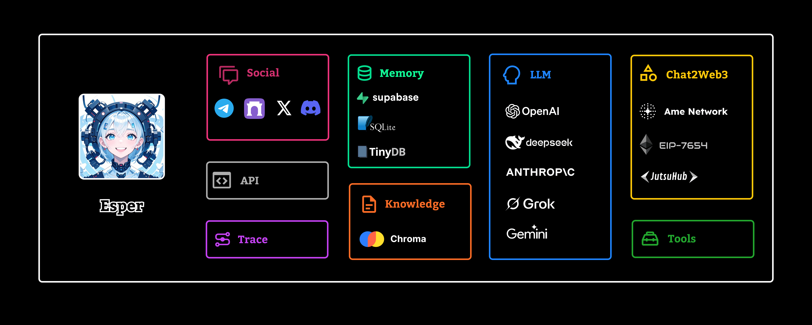

# Esper

<span style="color:red;font-weight:bold;font-size:18px;">⚠️ Note: Esper does not create any tokens!</span>


Esper is a lightweight, self-assembling AI agent. It focuses on building interactive onchain applications that combine AI with social content.



## Installation 

**Install from pypi:**

```bash
pip3 install ame-esper
```

**Clone the repository:**

```bash
git clone https://github.com/AmeNetwork/esper.git
cd esper
pip3 install requirements.txt
```

## Set up environment variables
Please refer to `.env.example` file, and create a `.env` file with your own settings. You can use two methods to import environment variables.

**Using python-dotenv:**  
```bash
pip install python-dotenv
```
Then add the following code to your python file.

```python
from dotenv import load_dotenv
load_dotenv()
```

**Exporting all variables in the terminal:**  
```bash
export $(grep -v '^#' .env | xargs)
```


## Code Examples
Here are some examples of how to use Esper:
```python

from esper import Agent
from esper.ame import AmeComponent
from eth_account import Account
from esper.memory import Memory
import os
from esper.chat2web3 import Chat2Web3

# Initialize AmeComponent, connecting to a local Ethereum node
component = AmeComponent(
    "http://127.0.0.1:8545",  # URL of the local Ethereum node
    "0x29a79095352a718B3D7Fe84E1F14E9F34A35598e"  # Contract address
)

# Get the methods of the contract
methods = component.get_methods()

# Retrieve the private key from environment variables
private_key = os.getenv("EVM_PRIVATE_KEY")

# Create an account using the private key
account = Account.from_key(private_key)

# Initialize Chat2Web3 object for handling blockchain interactions
chat2web3 = Chat2Web3("evm", account)

# Add a method named "getUserNameByAddress" to chat2web3
chat2web3.add(
    "getUserNameByAddress",
    "when a user want to get user name and age, it will return 2 value, one is name, the one is age",
    methods["getUser"],  # Use the getUser method from the contract
)

# Initialize Memory object using SQLite as storage
memory = Memory(type="sqlite")

# Create an Agent instance
agent = Agent(
    name="test",  # Agent name
    description="test",  # Agent description
    memory=memory,  # Use the previously created memory object
    model="gpt-4o",  # Specify the model to use
    chat2web3=chat2web3  # Use the previously created chat2web3 object
)

# Use the agent to chat and retrieve the username for a specific address
response = agent.chat("get user name 0xa0Ee7A142d267C1f36714E4a8F75612F20a79720")
