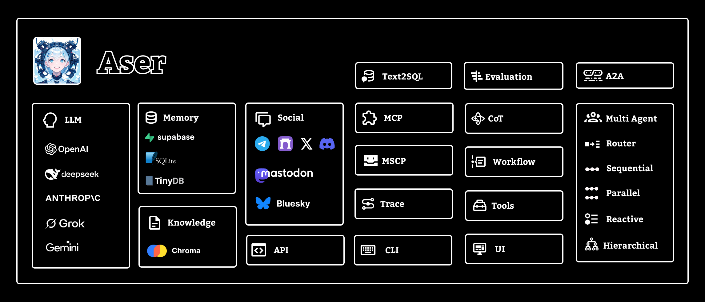

# Aser

Aser 配备了标准化的 AI 能力中间件，如知识、记忆、追踪、链式思考（CoT）、API 接口和社交客户端。通过动态集成 Web3 工具包，帮助开发者快速构建并上线具备原生 Web3 能力的 AI Agent。



[官网](https://ame.network) | [文档](https://docs.ame.network/aser/overview) | [获取支持](https://t.me/hello_rickey)  | [English](./README.md)

## 安装

**通过 pypi 安装：**

```bash
pip install aser
```

**或克隆仓库：**

```bash
git clone https://github.com/AmeNetwork/aser.git
cd aser
pip install -r requirements.txt
```

## 配置环境变量

请参考 `.env.example` 文件，并根据自己的设置创建 `.env` 文件。无需配置所有环境变量，只需选择你需要使用的部分。

**.env 文件示例：**
```bash
#MODEL
MODEL_BASE_URL=https://openrouter.ai/api/v1
MODEL_KEY=<你的模型密钥>
```

## 用法
```python
# 基础用法
from aser.agent import Agent
agent=Agent(name="aser agent",model="gpt-4.1-mini")
response=agent.chat("什么是比特币？")
print(response)
```
```python
# 完整配置
aser = Agent(
    name="aser",
    model="gpt-4o-mini", 
    tools=[web3bio, exa], 
    knowledge=knowledge,
    memory=memory,
    chat2web3=[connector],
    mcp=[price],
    trace=trace
)
```

## 快速开始
如果你是克隆项目源码，在运行示例前，请在根目录执行 `pip install -e .`，这样 Python 能从本地源码找到并导入 aser 模块。如果通过 `pip install aser` 安装，可直接运行示例。

### 入门：
你的第一个 AI Agent [示例](./examples/agent.py)

创建带模型配置的 AI Agent [示例](./examples/agent_model.py)

创建带记忆的 AI Agent [示例](./examples/agent_memory.py)

创建带知识的 AI Agent [示例](./examples/agent_knowledge.py)

创建带工具的 AI Agent [示例](./examples/agent_tools.py)

创建带工具包的 AI Agent [示例](./examples/agent_toolkits.py)

创建带追踪的 AI Agent [示例](./examples/agent_trace.py)

创建 AI Agent 服务端 [示例](./examples/agent_api.py)

创建带命令行的 AI Agent [示例](./examples/agent_cli.py)

创建 Discord AI Agent [示例](./examples/agent_discord.py)

创建 Telegram AI Agent [示例](./examples/agent_telegram.py)

创建 Farcaster AI Agent [示例](./examples/agent_farcaster.py)

### 进阶：

创建带链式思考的 AI Agent [示例](./examples/agent_cot.py)

创建带 MCP 的 AI Agent [示例](./examples/agent_mcp.py)

创建带工作流的 AI Agent [示例](./examples/agent_workflow.py)

创建带 UI 的 AI Agent [示例](https://github.com/AmeNetwork/ame-ui)

评估 AI Agent [示例](./examples/agent_evaluation.py)

路由多智能体 [示例](./examples/router_multi_agents.py)

顺序多智能体 [示例](./examples/sequential_multi_agents.py)

并行多智能体 [示例](./examples/parallel_multi_agents.py)

响应式多智能体 [示例](./examples/reactive_multi_agents.py)

分层多智能体 [示例](./examples/hierarchical_multi_agents.py)

### 高级：

创建带模型智能合约协议的 AI Agent [示例](https://github.com/AmeNetwork/Model-Smart-Contract-Protocol)